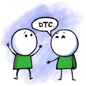
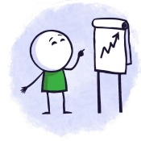

---

title: Welcome to DataTalks.Club
description:
  "DataTalks.Club &ndash; the place to talk about data"
image: images/cover.jpg
layout: home

---

  

    <h1>The place to talk about data</h1>
    <h2>Global online community of data enthusiasts</h2>
  



  

    

      
    

    <h4 class="landing-subtitle">Talk about data, machine  learning, and engineering</h4>
  

  

    

      
    

    <h4 class="landing-subtitle">Ask career questions and  discuss career options</h4>
  

  

    

      
    

    <h4 class="landing-subtitle">Attend weekly events,  conferences, and office hours</h4>
  

  

    
    <h4>Upcoming events</h4>
    <ul class="emoji-list">
      
        <li class="{{ event.type }}"></li>
      
    </ul>

    
Check <a href="/events.html">events</a> for all past events. You can also subscribe to <a href="https://calendar.google.com/calendar/?cid=ZjhxaWRqbnEwamhzY3A4ODA5azFlZ2hzNjBAZ3JvdXAuY2FsZW5kYXIuZ29vZ2xlLmNvbQ" target="_blank">our Google calendar</a> to get notified about all our events.

    
&nbsp;

    
    <h4>Latest podcast episodes</h4>
    <ul>
      
        <li><a href="{{ episode.id }}.html">{{ episode.title }}</a> with 
          </li>
      
    </ul>

    
Check the <a href="/podcast.html">podcast</a> page for all past podcast episodes.

    
&nbsp;

    <h4>Book of the week</h4>
    
    <ul>
      
        <li>
          <a href="{{ book.id }}.html">{{ book.title }}</a> by 
            ({{ book.start | date_to_string }} &ndash; {{ book.end | date_to_string }})
        </li>
      
    </ul>

    
Check the <a href="/books.html">book of the week</a> page for more books!

    
    
&nbsp;

    <h4>Latest articles</h4>
    <ul>
      
        <li>
          <a href="{{ post.url }}">{{ post.title }}</a> by
            
        </li>
      
    </ul>

  

